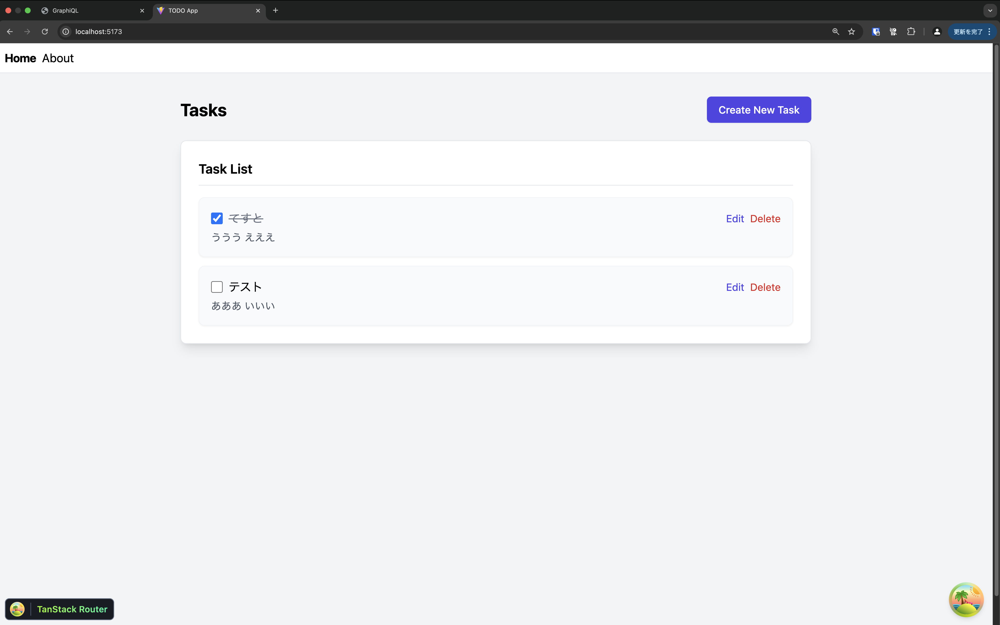

# チーム開発の会で学んでいる技術を使ってサンプルTODOアプリを作成してみた **with Cursor**

---

# 自己紹介

- ハンドルネーム: oh
- 仕事: AWS上に構築している社内システムの運用、など
- 最近取り組んでいること:
  - 運動 (筋トレ、ランニング)
  - 早寝早起き

---

# 作ったもの

チーム開発で学んでいる技術の理解を深めるために、それらを使ってサンプルTODOアプリを作成してみました。

## リポジトリ
https://github.com/oh84/sample-todo-app

---

# 作ったもの

最低限のCRUD機能だけですが作成してみました。

---

# 使用技術について

## バックエンド
- Ruby on Rails 7.1 (土曜の会で学習)
- GraphQL (土曜の会で学習)
- PostgreSQL

## フロントエンド
- React 18
- Vite (月曜の会で学習)
- TanStack Router/Query (月曜の会で学習)
- Tailwind CSS

---

# 作ってみて

- Railsの最初の環境構築が少し難しかった
(色々オプションがあってよくわかってない)
- 実際にサンプルアプリを作ってみて、どのように使うのか少し理解が深まった
- デプロイ周りがまだできてないので、CDKを使ってやってみたい

---

# Cursorを使ってみて

- 先日Cursorを登録してみたところ、無料期間があったので使ってみました。
- 個人的にUIがGitHub Copilotよりもだいぶ使いやすいと思いました。
- コード生成の質も高い気がします。
- READMEを作成してもらえたのが地味に便利でした。

---

# まとめ

- 実際にアプリを作成してみることで理解が深まった
- Cursorすごい
